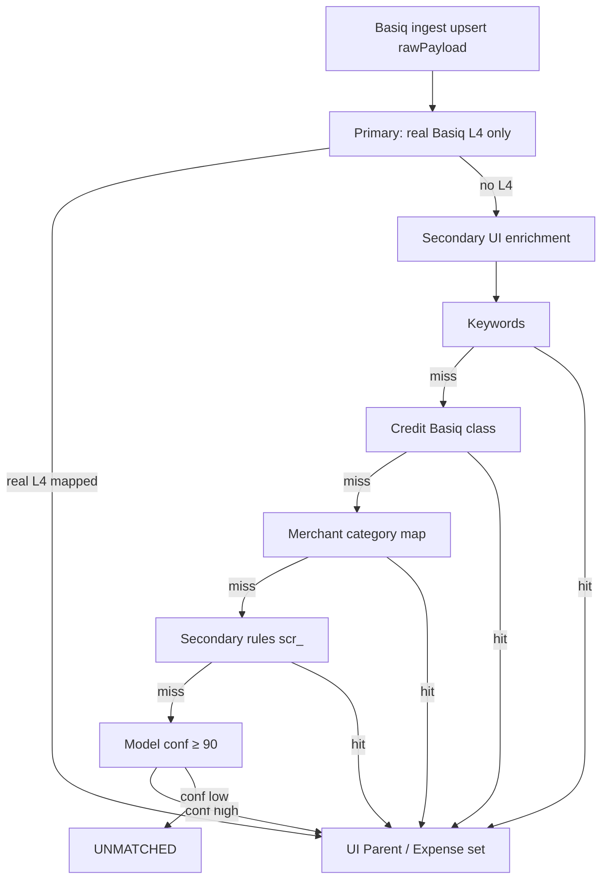

# Hybrid secondary categorisation — as-built summary

**Status:** As-built (Phases 0–4 implemented); Phase 5 (100k hardening) optional  
**Product:** MoneyMap  
**Doc type:** Engineering as-built / Confluence paste  
**Related ops runbook:** [Transaction taxonomy categoriser](TAXONOMY_CATEGORISER.md)  
**Last updated:** 2026-07-21  

Copy into Confluence via Markdown paste (or Insert → Markup → Markdown). Keep the mermaid diagram with Confluence’s Mermaid macro, or replace with an exported image.

### Change log

| Date | Summary |
|------|---------|
| 2026-07-21 | As-built refresh: Basiq source-field audit invariants; L3/L4 collision fix; secondary UI-only enrichment; latest force-run metrics + export |
| 2026-07-20 | Phases 0–4 implemented (merchant map, model, propose-rules, admin metrics) |

### Implementation status (repo)

| Phase | Status |
|-------|--------|
| 0 Foundations (`MODEL`, features, admin metrics) | **Done** |
| 1 Merchant map + seeds | **Done** |
| 2 Hashed logistic model train/serve + shadow | **Done** |
| 3 Offline propose-rules (labelled + optional LLM) | **Done** |
| 4 Admin metrics + runbook in TAXONOMY_CATEGORISER | **Done** |
| 5 100k hardening / persisted merchantKey | Not started |

---

## 1. Problem statement

Basiq often returns **coarse L3 only** (or empty subclass), so primary L4→UI mapping alone leaves a long tail unmatched. Secondary enrichment must label those txs for the user **without inventing or overwriting Basiq source fields**, and without running LLMs on the ingest hot path.

**Target:** sustainably categorise **10k–100k** weakly enriched transactions with high accuracy and full auditability.

---

## 2. Goals and non-goals

### Goals

| Goal | Measure |
|------|---------|
| High-accuracy bulk labelling of unmatched txs | Precision of auto-applies ≥ 95% on sampled audit |
| Auditable assignments + rollback | Every change writes `category_assignment_events`; revoke by rule / pin model version |
| Confidence-gated auto-apply | Model auto-apply only when confidence ≥ **90** (tunable) |
| LLMs offline as rule factory | No LLM calls inside ingest / per-tx classify |
| Basiq audit integrity | `rawPayload` and denormalized L3/L4 never invented by enrichment |
| Compatible with future tier-3 user rules | Reserved `USER_RULE`; not blocking schema |

### Non-goals (this build)

- Agentic LLM classification of every inbound transaction
- Replacing primary expense/credit taxonomies
- Full per-user approval UI (tier 3) — enum already reserved
- Mutating Basiq payload or fabricating ANZSIC codes for “completeness”

---

## 3. As-built architecture

### Hot-path order (locked)

1. **Primary** — user Parent/Expense **only** when Basiq provides a **real L4** → `BASIQ_ENRICH` via `end_user_expense_mapping.csv`
2. **Secondary** (only if primary left L4 empty), in order:
   1. Description **keywords** → `KEYWORD`
   2. Credit **Basiq `class`** → `BASIQ_CLASS`
   3. **Merchant map** → `SECONDARY_PATTERN` (`merchant-map-v1`)
   4. Deterministic **`scr_` rules** → `SECONDARY_PATTERN`
   5. Confidence-gated **model** → `MODEL` (`clf-…`, floor 90)
3. Else remain `UNMATCHED`
4. Every UI category change appends `category_assignment_events`

Credits never receive primary ANZSIC labels (no L4). Income API may still stamp credits as `INCOME_API` on the UI fields only.

### Assignment ladder

| Tier | Mechanism | Audit stamp |
|------|-----------|-------------|
| **1 Primary** | Real Basiq L4 → mapping CSV | `BASIQ_ENRICH`; `categoryRuleId` null |
| **2 Keywords / class** | Description keywords; credit `class` | `KEYWORD` / `BASIQ_CLASS` |
| **2a Merchant map** | Normalized merchant key → Parent/Expense | `SECONDARY_PATTERN` + `merchant-map-v1` |
| **2b Rules** | Global `SecondaryCategoryRule` (`scr_…`) | `SECONDARY_PATTERN` + `categoryRuleId` |
| **2c Model** | Hashed logistic classifier | `MODEL` + `categoryMatcherVersion=clf-YYYYMMDD` |
| **Income** | Basiq Income API history match | `INCOME_API` |
| **3 Future** | Per-user instruction + UI approval | `USER_RULE` |

### Matcher versions (current)

| Component | Version |
|-----------|---------|
| Expense mapping / primary | `expense-map-v5` |
| Credit / income | `credit-income-v1` |
| Secondary rules | `secondary-v1` |
| Merchant map | `merchant-map-v1` |
| Model (pinned artefact) | `clf-20260720` |

---

## 4. Critical design invariants (as-built)

These are product/audit requirements, not optional polish.

### 4.1 User categories vs Basiq source

| Field | Owner | Categorisation may write? |
|-------|--------|---------------------------|
| `rawPayload` | Basiq ingest | **No** — never mutated by categorise |
| `subclassCode` (denorm L4) | Basiq only | **Only** if Basiq sent a real L4 (else `null`) |
| `groupCode` (denorm L3) | Basiq only | **Only** if Basiq sent L3 / implied by real L4 (else `null`) |
| `basiqTxClass` | Basiq `class` | Copy from payload only |
| `parentCategory` / `expenseCategory` | MoneyMap UI enrichment | **Yes** — this is what the user sees |
| `categorySource`, confidence, matcher version, `categoryRuleId` | MoneyMap audit | **Yes** |

**Rule:** If Basiq left L3/L4 empty, those columns **stay empty**. Secondary must **not** invent L4 codes (e.g. keyword `4110`) into `subclassCode`.

### 4.2 L3 vs L4 code collision

Basiq frequently places **L3 group codes** in `subClass.code` (e.g. `411` = Supermarket). The mapping file can also contain a **colliding L4** with the same numeric string (e.g. `411` = Coal Mining → Bulk Fuel).

**As-built fix** (`classifyBasiqAnzsicCode`): prefer a **known L3 group** over a colliding L4 row. True four-digit L4s (e.g. `4110`, `2611`) still classify as L4. When L4 is present it is master; parent L3 comes from that L4’s mapping row.

### 4.3 Secondary L3 family scope

When Basiq provided an **L3** and L4 is empty, secondary may only assign a UI label whose **mapping L4 sits under that L3**. Out-of-family candidates (e.g. Internet/`5801` under cafes/`451`) are skipped. Scope uses the mapping table for the check; it does **not** persist an invented L4.

When primary already mapped a real L4 → secondary **does not run**.

---

## 5. What shipped (component map)

| Component | Location / behaviour |
|-----------|----------------------|
| Primary categoriser | `src/server/taxonomy/categoriser.ts` |
| ANZSIC classify + mapping | `src/server/taxonomy/expenseMapping.ts`, `end_user_expense_mapping.csv` |
| Keyword rules | `src/server/taxonomy/keywordRules.ts` |
| Credit taxonomy | `src/server/taxonomy/creditTaxonomy.ts` |
| Secondary orchestration | `src/server/taxonomy/secondaryPatterns/applySecondaryEnrichment.ts` |
| Merchant map | `src/server/taxonomy/merchantMap.ts` |
| `scr_` rules / miner / seed / propose | `src/server/taxonomy/secondaryPatterns/` |
| Model train/serve | `src/server/taxonomy/secondaryModel/`, `models/category-clf/{version}/` |
| Persist + events | `src/server/data/categoriseTransactions.ts` |
| Income API annotate | `src/server/data/syncIncome.ts` (UI fields only) |
| Admin API | `src/app/api/admin/taxonomy/route.ts` |
| Ops doc | `docs/TAXONOMY_CATEGORISER.md` |

### Scripts

| Script | Purpose |
|--------|---------|
| `npm run categorise:transactions -- --force` | Full owner backfill |
| `npm run categorise:merchant-map` | Build merchant map from labels |
| `npm run categorise:secondary-seed` / `secondary-mine` | Seed / mine `scr_` rules |
| `npm run categorise:train-model` | Train hashed logistic artefact |
| `npm run categorise:propose-rules` | Offline rule proposals (`--llm` optional) |
| `npx tsx --env-file=.env scripts/export_all_categorised_transactions.mts` | CSV with user Parent/Expense |
| `npm run test:taxonomy-categoriser` | Primary + secondary invariants |

### Admin / rollback

- Disable / revoke / mine / seed / build-merchant-map / propose-rules via `POST /api/admin/taxonomy`
- Revoke with `rollback: true` clears **UI** enrichment only (does not invent Basiq codes)
- Model rollback: change/remove `CATEGORY_MODEL_VERSION`, force recategorise

---

## 6. Latest measured results (dev dataset)

**Run:** force categorise + export, 2026-07-21  

| Metric | Value |
|--------|-------|
| Transactions | 986 |
| User categorised (Parent + Expense) | **699** |
| Unmatched | **287** |
| Primary L4 matched | **0** (sandbox almost entirely L3-only in `subClass`) |
| Keyword | 541 |
| Merchant map | 74 |
| Model (`clf-20260720`) | 38 |
| Basiq class (credits) | 32 |
| Invented L4 remaining in `subclassCode` | **0** (verified after force run) |

**Export file (user-facing categories):**  
`all_categorised_transactions_2026-07-20T21-27-23.csv`  
Key columns: `parent_category`, `expense_category`, `category_source`, plus Basiq audit columns from payload / denorm.

**Basiq code audit on same set:** 912 txs had a code; **0** true L4; **801** L3-only; 74 empty. Top codes: `451`, `411`, `0`, `400`, `426`, …

---

## 7. Delivery phases (historical plan → status)

Estimates below were planning figures; status reflects the repo as of the last update.

### Phase 0 — Foundations — **Done**

`CategorySource.MODEL`, shared features, admin baseline metrics.

### Phase 1 — Merchant map + deterministic rules — **Done**

`merchant_category_map`, build-from-labels, seeds, events, revoke-by-`ruleId`.

### Phase 2 — Supervised model — **Done**

Hashed logistic regression, artefacts under `models/category-clf/`, env pin, shadow mode, auto-apply ≥ 90.

### Phase 3 — Offline LLM rule factory — **Done**

`categorise:propose-rules` with vocabulary constraint; CANDIDATE vs gated ACTIVE; no LLM on ingest.

### Phase 4 — Retrain loop + observability — **Done**

Admin GET metrics + alerts (`unmatchedRateHigh` &gt; 15%); runbook in TAXONOMY_CATEGORISER.

### Phase 5 — Hardening for 100k — **Not started**

Chunked categorise, batched inference, optional persisted `merchantKey`, load test.

---

## 8. Risks and mitigations

| Risk | Mitigation |
|------|------------|
| Model learns bad secondary labels | Prefer primary-quality labels; confidence floor 90; shadow mode |
| Merchant token collision | Require high label agreement before map row |
| LLM invents categories outside taxonomy | Constrain to known Parent/Expense sets; reject otherwise |
| Over-auto-apply | Confidence floor; revoke + `category_assignment_events` |
| Invented L4 polluting audit | Persist L3/L4 **only** from `extractBasiqCodes(rawPayload)` |
| L3 stuffed into `subClass.code` mapped as wrong L4 | Prefer known L3 over colliding L4 in classifier |
| Windows Prisma `EPERM` on generate | Stop Next/dev before `prisma generate` / migrate |

---

## 9. Success metrics

| Metric | Target (initial) | Notes |
|--------|------------------|-------|
| Unmatched rate after full pipeline | &lt; 5% of debits (tune with product) | Dev sandbox currently ~29% unmatched — L3-only + long tail |
| Precision of MODEL auto-applies (sampled audit) | ≥ 95% | Ops spot-check |
| Volume mix | Report % by `category_source` | Admin GET + export CSV |
| Time to promote a new high-frequency merchant | &lt; 7 days | Map / `scr_` / propose-rules |
| Basiq source integrity | 0 invented L4 in `subclassCode` | Force categorise + audit script |

---

## 10. Open / follow-up

| Item | Status |
|------|--------|
| Stamp merchant-map via `scr_` only vs dedicated matcher version | As-built: dedicated `merchant-map-v1` + optional `scr_` |
| Store model confidence on tx column | Events + `categoryConfidence` on tx used |
| Phase 5 persisted `merchantKey` + 100k SLA | Not started |
| Tier-3 `USER_RULE` UI | Reserved only |

---

## 11. References (repo)

| Artefact | Path |
|----------|------|
| This as-built plan | `docs/HYBRID_SECONDARY_CATEGORISATION_PLAN.md` |
| Ops / runbook | `docs/TAXONOMY_CATEGORISER.md` |
| Primary mapping | `end_user_expense_mapping.csv` |
| Credit taxonomy | `src/server/taxonomy/creditTaxonomy.ts` |
| Secondary patterns | `src/server/taxonomy/secondaryPatterns/` |
| Owner categorise | `src/server/data/categoriseTransactions.ts` |
| Admin taxonomy | `src/app/api/admin/taxonomy/route.ts` |
| Schema | `prisma/schema.prisma` (`SecondaryCategoryRule`, `CategoryAssignmentEvent`, `CategorySource`, `MerchantCategoryMap`) |

---

## 12. Confluence paste tips

1. Create or update page: **MoneyMap → Taxonomy → Hybrid secondary categorisation (as-built)**.
2. Paste Markdown (Confluence Markdown macro) **or** convert headings to wiki (`h1.`, `h2.`, `h3.`).
3. Insert Mermaid macro for the architecture diagram (section 3).
4. Keep the **Change log** table at the top for stakeholders.
5. Link sibling page: TAXONOMY_CATEGORISER runbook for day-to-day ops commands.
