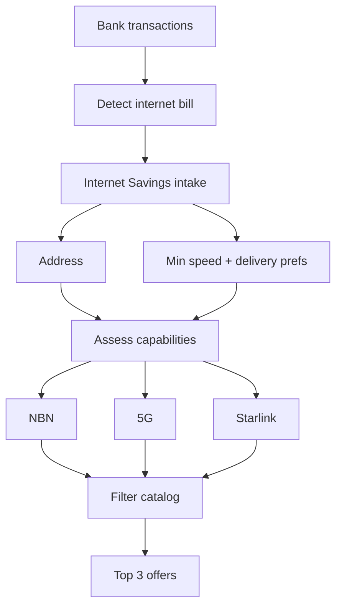

# How internet recommendations work

Bank bill in → address + delivery prefs → capability check (NBN + 5G + Starlink) → three relevant plans out.

**Big picture:** Bank txs → Find bill → **Internet Savings intake** → NBN / 5G / Starlink assessment → Filter → Top 3

Home page: **Internet Savings** button is amber when no internet bill is detected, green when one exists.

## Step by step

| # | Step | Input → Output | What happens | Example |
|---|------|----------------|--------------|---------|
| 1 | Bank data arrives | Basiq → Transactions | Open banking sync stores your bank transactions in MoneyMap. | Debit $89 · "AAPT NBN" · 12 Jun |
| 2 | Detect the internet bill | Transactions → DetectedBill | We scan merchants for ISP patterns and find the recurring internet payment. | Internet · ~$89/mo · likely AAPT · confidence high |
| 3 | Internet Savings intake | DetectedBill → Address + NeedProfile | User opens Internet Savings (green) and enters service address + how they will accept speed (wired/5G/Starlink) + min Mbps. | 12 Example St, NSW 2000 · min 100 · allow wired+5G |
| 4 | Assess what is physically possible | Address → Capabilities | Stage 3 currently runs an HFC stub so the E2E flow can be tested. It persists a point-in-time assessment and access option. | NBN HFC available · max 1000/50 |
| 5 | Filter market offers | Capabilities + Profile + Catalog → Eligible set | Keep Active offers whose connection type is possible at the address and that meet prefs/speeds. | NBN + 5G + Starlink plans that fit → 55 eligible |
| 6 | Pick top 3 | Eligible set → Recommendations | Rank by saving vs current bill (then value). Optionally diversify across access types. | 1st FTTP save $420 · 2nd 5G · 3rd Starlink |

## Step 2 intake fields (current)

| Field | Required | Notes |
|-------|----------|-------|
| Street, suburb, state, postcode | Yes | Stored on `UserAddress` |
| Minimum download Mbps | Yes | Stored on `UserNeedProfile` |
| Allow Wired/NBN, 5G, Starlink | Yes (≥1) | Delivery preference before capability lookup |

Amber path: no detected bill → blocked message (no form).

## Capability check (step 4 detail)

Stage 3 testing assumption: every saved address has **NBN HFC available**.
The `stub-hfc-v1` provider returns HFC at up to 1000/50 and stores the
assessment history. Real NBN, 5G, and Starlink sources will replace/add
providers behind the same capability interface.

| Access path | What we look up |
|-------------|-----------------|
| **NBN (current)** | Stubbed HFC availability and test speeds. |
| **5G (later)** | Fixed-wireless / home 5G coverage and expected speed band. |
| **Starlink (later)** | Serviceability at the coordinates. |

## Where they meet

Eligible offers = catalog plans whose **connection type is possible at the address** and whose speeds fit both physical limits and user preferences — then ranked by savings vs the detected bill.

## Flow diagram (Mermaid)

